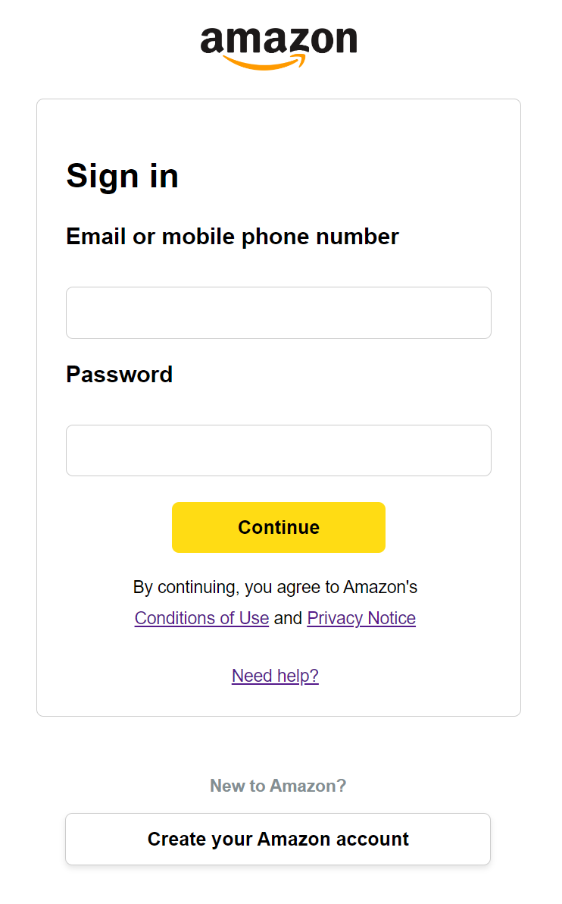
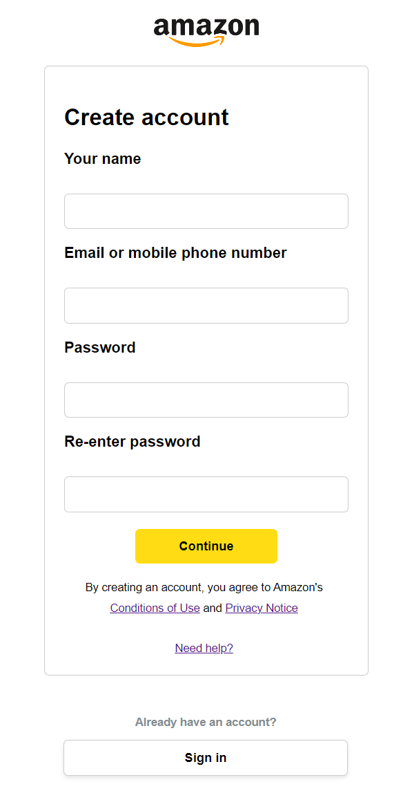

# Amazon Sign-in Clone and Amazon Create Account Clone


Amazon Sign-in Clone with Amazon Create Account Clone is a HTML clone of Amazon sign-in and create account page.

I am not responsible for any damage caused using this clone of Amazon sign in and Amazon create account clone.

## Screenshots





## Discord


Discord: @intosins
  
## Usage

U don't need to install anything, just run the signin.html or createaccount.html with Live Server extension installed in your VS code.

```bash
1. Clone the repository:
git clone https://github.com/intosins/amazon-sign-in-clone.git
cd amazon-sign-in-clone
